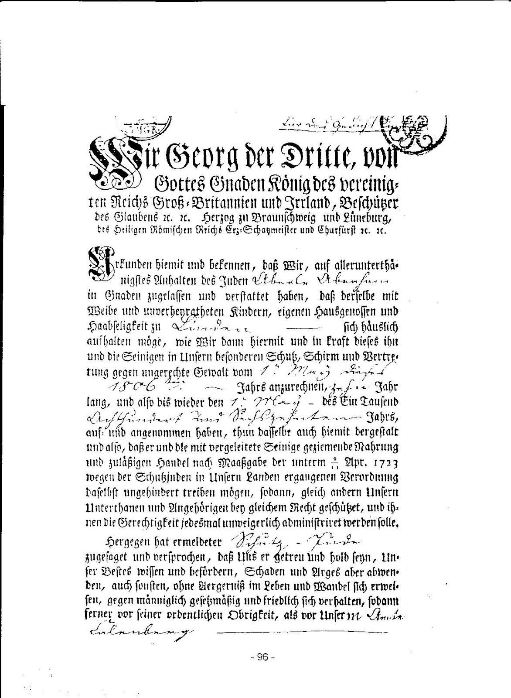
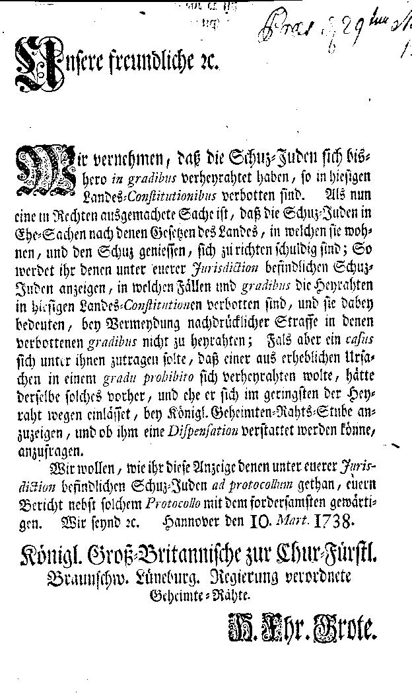

**Der Schutzbrief**

Schon Jahrhunderte lang waren den Juden Schutz- oder Geleitbriefe ausgestellt worden, manchmal vom Landesherrn, manchmal von den Städten oder auch von den Gerichtsherren der Adeligen Patrimonialgerichte.

<!--truncate-->

1687 regelte  Herzog Ernst August für seine welfischen Lande, das spätere Kurfürstentum Hannover, die Schutzverleihung, die er für sich allein in Anspruch nahm. Den Städten und  adligen Gerichten sprach er alles Recht der Ausstellung von Schutzbriefen ab. Die nicht unbeträchtlichen Geldsummen, die die Juden für die Schutzbriefe bezahlen mußten, sollten allein in die landesherrliche  Schatulle fließen. Sein Sohn, der Kurfürst Georg Ludwig, der 1714 als König Georg I den englischen Thron bestieg, bestätigte während seiner Regierungszeit dieses Schutzgeld-Edikt und erließ außerdem noch eine ganze Reihe anderer Judenordnungen.

Der Schutz erstreckte sich auf die Person des Juden, seine Ehefrau, seine unverheirateten Kinder, so lange sie in seinem Haus wohnten, und auf diejenige Anzahl von Dienstboten, die den Juden erlaubt war. Wollten sich die Kinder von Schutzjuden verheiraten, oder von ihren Eltern separieren, so bedurften sie eines besonderen Schutzbriefes. (Heiratserlaubnis erhielt von den Söhnen meistens nur der älteste). Der Schutzbrief gewährte das Recht ungestörten Aufenthaltes im Lande auf begrenzte Zeit, zunächst 6 Jahre, Schutz für Leben , Freiheit und Eigentum, ungestörte Ausübung der jüdischen Religion und sicherte den Inhaber davor, nach Willkür der Behörden außer Landes verwiesen zu werden. Er gestattete, nach Maßgabe der Beschränkungen durch die Landesgesetze, Handel- und Wechselgeschäfte zu treiben. Dagegen gewährte der Schutzbrief weder Bürger- noch Heimatrecht.

Ganz andere Vorschriften galten dagegen für die unvergleiteten Juden: Sie waren häufig vor Pogromen geflüchtete Osteuropäer. Sie zählten zu den „Armen" und man versuchte, sie sich durch Kontingentierung vom Halse zu halten.

So hieß es:

Sie werden als Fremde behandelt. Sie dürfen sich an einem Ort nur 3 Tage, in Hannover 8 Tage, bei andern Juden aufhalten und müssen einen Leibzoll erlegen. Wer länger verweilt, wird „allsofort weggeschafft" und muß nach Maßgabe seines Vermögens  1O - 15 Reichstaler Strafe an die Ortsarmenkasse zahlen. An den Denunzianten müssen außerdem noch 5 - 1O Reichstaler gezahlt werden.

Dies alles gilt aber nur für die sog. „reputierlichen Juden" (Verordnung vom 9. Juni 1733).

„Betteljuden" sollen dagegen gar nicht zugelassen werden.

*Werden sie ertappt, so werden sie zum erstenmal mit 14täiger harter Gefängnisstrafe bei Wasser und Brot belegt und über die Grenze gebracht, beim zweitenmal erhalten sie ein Brandmal, und beim dritten Male werden sie einfach aufgehängt.*

(Edikt vom 14. Aug. 1714). Diese Gesetzgebung zwang sie natürlich erst recht zum Vagabundieren.

Die Judenordnungen waren aber in den verschiedenen deutschen Fürstentümern durchaus nicht überall gleich. Was den Juden in dem einen Land verboten war, war ihnen im Nachbarland vielleicht erlaubt. Es gab so gut wie nichts, was überall einheitlich geregelt war.

Etwa 9O % der im Kurfürstentum Hannover lebenden Juden wohnten in den Städten oder in größeren Orten. Auf dem platten Lande gab es wenige, was mit dem Verbot von Grunderwerb und anderen Berufsbeschränkungen zusammenhing. Ackerbau war ihnen nach der Feudalverfassung verboten.

Wenn ein Jude bei der Landdrostei einen Antrag auf einen Schutzbrief stellte oder ein Schutzbrief von einer Gemeinde wegen Umzugs auf eine andere Gemeinde transferiert werden sollte, so wurden genaue Erkundigungen über den betreffenden eingeholt. Der Schutzbrieferteilung wurde nur stattgegeben, wenn die Auskünfte ohne jegliche Beanstandung waren. Die Landdrosteien vertraten den Standpunkt, daß die Juden freiwillig ins Land gekommen seien zu den bekannten Konditionen, daß sie jederzeit des Landes verwiesen werden konnten. Die Anzahl der Juden sollte eine statische Größe bleiben. Es sei immer von dem Grundsatz auszugehen: „Das Kurfürstentum sei ein christliches Land und solle es bleiben.“

1) Dr. jur. Abraham Löb,  Frankfurt 19O8: Rechtsverhältnisse der Juden im ehemaligen Königreiche und der jetzigen Provinz Hannover

2) M. Zuckermann, Hannover 1912 Kollektanea zur Geschichte der Juden im Hannoverland

# 

# 3) Niedersächsisches Jahrbuch 1992 Bd. 64, vom Historischen Verein f. Niedersachsen, Verlag Hahnsche Buchhndlg. Hannover 1992, Uwe Eissing S. 287 ff.

# 

# 4) Chur-Braunschweig-Lüneburgische Landesordnungen und Gesetze IV Teil,

# von Policey - Sachen

# zum Gebrauch der Fürstenthümer Graf- und Herrschafften Calenbergischen Theils

Göttingen 1740, in Verlag der Königl. privilegirten Universitäts Buchhandlung
