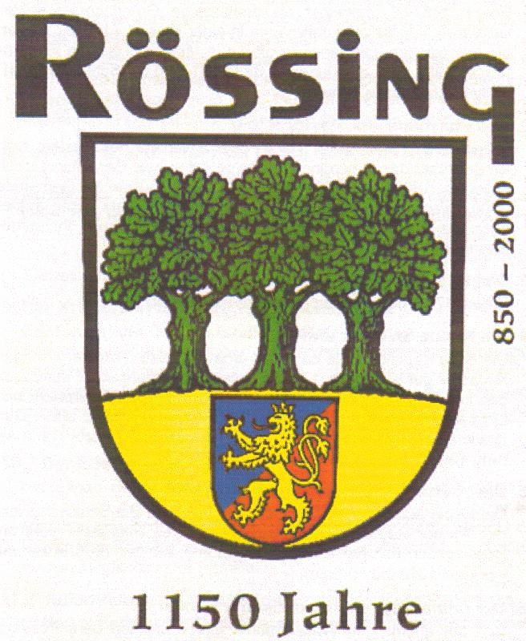

**Aus der Geschichte eines alten Dorfes**  
  
Viele Dörfer in den Altsiedellandschaften des Calenberger Landes feierten um die Jahrtausendwende ihr 900- , 1000- oder gar 1111jähriges Bestehen. Auch die Rössinger haben das ganze Jahr 2000 hindurch mit vielen Veranstaltungen den 1150sten 'Geburtstag' ihres Dorfes gebührend gefeiert.

Das Alter einer Ortschaft rechnet man vom Zeitpunkt ihrer ersten urkundlichen Erwähnung an. Natürlich war der Ort Rössing, bevor die Ansiedling aktenkundig wurde, bereits bewohnt. Die älteste schriftliche Überlieferung finden wir in der älteren Reihe der *Corveyer Traditionen*, die zwischen 822, dem Gründungsjahr der Benediktinerabtei in Corvey an der Weser, und 877 entstanden sind. Diese Schriften enthalten einfache, undatierte Verzeichnisse der dem Kloster übereigneten Grundstücke und Ländereien in lateinischer Schrift. Der Geber und seine Gaben werden genannt, Personen, in deren Interesse die Schenkung erfolgte, und eine Reihe Zeugen. Die Schenkung selber fand als symbolischer Akt statt - durch die Übergabe eines Zweiges oder eines Rasenstücks.

Doch diese *Corveyer Traditionen* sind im Original nicht mehr erhalten. Sie zerfielen und vermoderten im Laufe von über tausend Jahren. So ist die älteste Überlieferung des Namens Rössing 'nur' in einer Abschrift enthalten, die der Priester und Kreuzherr Johannes von Falkenhagen im Jahre 1479 angefertigt hat. Dieses mit großer Sorgfalt ausgeführte Dokument stellt die wertvollste Unterlage der derzeitigen historischen Untersuchungen dar.

Rössing ist darin in unterschiedlicher Schreibweise zweimal verzeichnet. Denn der Schreiber hat die abgeschriebenen alten Ortsnamen zusätzlich in der Schreibweise des 15. Jahrhunderts am Rande des Dokuments ausgeworfen. So steht für das alte rotthingun am Rande rotthingen. Und bei der zweiten Eintragung heißt es im Text hrottingun und am Rande rottingen - was sich exakt mit der Schreibweise für Rössing in damaliger Zeit deckt.

Unter Berücksichtigung dieser Tatsachen kann man das Jahr 850 – also die Mitte zwischen 822 und 877 - als den Zeitpunkt annehmen, an dem Rössing urkundlich gegründet sein muss. Die Feiern zum 1150 jährigen Bestehen von Rössing im Jahr 2000 fanden also auf quellensicherem geschichtlichem Boden statt.

Quelle: Staatsarchiv Münster, Corvey-Akten Nr. 1419

---

*Aus der Reihe von Helga Fredebold, ursprünglich veröffentlicht am 2012-01-13 auf [fredebold.blogspot.com](https://fredebold.blogspot.com/2012/01/rossing-aus-der-geschichte-eines-alten.html).*
