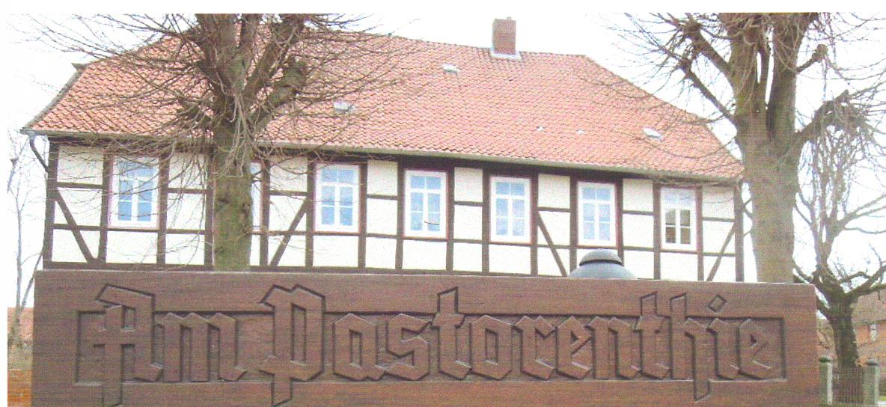

Foto: Erhard Wolpert

  
**Am Pastorenthie**

In vielen niedersächsischen Dörfern erinnern noch heute Ortsbezeichnungen mit der Silbe Thie, Thing oder auch Ding an Gerichtsstätten und Versammlungsplätze aus früheren Jahrhunderten.

Auch in Rössing gab und gibt es einen solchen Platz. In der Ortsmitte am Fuße des kleinen Hügels mit dem Pfarrhaus stehen zwei Linden und davor ein geschnitztes Straßenschild: „Am Pastorenthie“, das die Erinnerung an einen Gerichtsplatz wachhält.

Durch vor einiger Zeit aufgefundene alte Prozeßakten erhält dieser Platz eine ganz besondere Bedeutung. Die teilweise über 400 Jahre alten Gerichtsprotokolle befassen sich mit den hier regelmäßig abgehaltenen Meierdingsgerichten. Der Ort, an dem diese stattfanden, war mit Sicherheit der durch Linden gekennzeichnete Platz vor dem Pfarrhaus, der „Pastorenthie.“ Denn Rössing war der Sitz eines Meierdings und auch Bauern, die in Giesen Land beackerten, das zu diesem Meierding gehörte, mußten zum Meierdingsgericht nach Rössing.

An anderen Ortschaften gab es auch andere Gerichte oder Thingstätten, wie z.B.das „Freiding“ in Giesen für die freien Bauern des „Güldenen Winkels“, zu dem die Ortschaften Himmelsthür, Emmerke, Sorsum, Escherde, Barnten, Rössing, Beelte und Giesen zählten. Die Besitzer von Freidingsland durften nur dieses beackern, um als freie Bauern zu gelten. Sie hatten ihren Gerichtsplatz mit dem Thiestein in Giesen. Dort wurde ihre Grundstücksangelegenheiten – und nur diese – behandelt.

Das „Goding“ befaßte sich mit Kriminalfällen und Landesjustiz, dessen Aufgaben Ende des 16. Jahrhunderts teilweise die Landgerichte der Ämterverwaltungen übernahmen und das „Holtding“ war zuständig für Holz- und Waldangelegenheiten.

Aber Rössing hatte ein Meierding und ein Meierdingsgericht. (1)

**Das Meierdingsland und das Meierdingsgericht**

Das Meierdingsgericht verhandelt und entscheidet Angelegenheiten, die das Meierdingsland betreffen. Alle Bauern, die Meierdingsland besitzen, auch wenn es nur ein ganz kleines Stück ist – gehören zu den Erben. Das Land, das von dem altfeudalen Meierding herstammt, hat bis ins 19. Jahrhundert immer einen besonderen rechtlichen Status behalten. Es ist Erbland und daher besonders begehrt und wertvoll.

Die rechtliche Stellung der Hörigen, der Laten, hat sich gegenüber der frühmittelalterlichen Situation verändert. Eine neue gesellschaftliche Ordnung hat sich zum Ende des 16. Jahrhunderts durchgesetzt. Die Bauern werden persönlich frei. Die Strukturen des alten Meierdings verändern sich und es zerfällt in Einzelhöfe.

Die Besitzer von Meierdingsland können frei über dies Land verfügen, sie können es vererben, verpfänden oder auch verschenken, denn es gehört ihnen. Verpfändungen und Veräußerungen von Meierdingsland, Verschreibungen als Altenteil usw. werden sorgfältig hier verhandelt und genau im „Meierdingsbuche“ festgehalten, wie heute in den Grundbüchern.

Für die Zeit ab 1589 sind sehr ausführliche Aktenprotokolle über die in Rössing abgehaltenen Meierdingsgerichte erhalten: 1589, vier Protokolle in 1604, 1608, 1615, 1616, 1618, 1620, 1621, 1630, 1650, 1659, 1662. Sie enthalten Kauf- und Pfandbriefe sowie Prozeßakten. Das Papier ist vergilbt, die Tinte, mit dem Federkiel zu Papier gebracht, ist nach 400 Jahren verblaßt, die Schrift kaum zu entziffern. Und der Sand, der damals die Tintenschrift löschte – trocknete, rieselt z.T. noch heute aus den Seiten des Dokuments. (2)

Später wird die Aktenlage über das Meierding dünn.

Die alten Meierdingsgerichte folgen festen Verfahrensregeln und Ritualen, die heute schwer verständlich sind. Zuerst fragt der Meierdingsvogt die alten Rechtsgrundsätze ab, die immer auf die gleiche Weise von zwei gewählten *Vorsprechern* beantwortet werden müssen. Niemand darf im Verfahren seine Streitfragen selbst vortragen oder ungefragt sprechen, auch dies ist Aufgabe der *Vorsprecher.*

Als 1538 das Meierding Rössing in den Besitz der Calenberger Herzöge übergeht,

treten die Calenbergischen Beamten, also Amtmann und Amtsschreiber als Gerichts- und Meierdingsherr in Vertretung ihres Landesherrn auf, der hier als *lllustrissimo* bezeichnet wird. Von jedem Landverkauf, der hier getätigt wird, stehen ihm 2,5% des Erlöses zu. Alle Umsatzgebühren werden genau registriert.

Die typischen Abgaben der Meierdingsleute an den Grundherrn, der hier auch der Landesherrn ist, sind bei Heirat *Bedemund* (Betterlaubnis) und im Erbfall *Baulebung* Und jedes Jahr ist ein Hals- oder Rauchhuhn abzuliefern – eine Überlieferung aus der Zeit, als die Hörigen noch als *Halseigene* bezeichnet wurden. Rauchhühner sind keine geräucherten Hühner, sondern der Zins für einen Hof, bzw. für ein Haus, aus dem Rauch aufsteigt, das also eine Feuerstätte hat.

**Das Meierrecht**

Als die Fronhofsverbände zerfallen, bilden sich Vorformen des Meierrechtes.

Durch Hofzusammenlegungen entstehen aus den ehemaligen Ein-Hufe-Höfen sogenannte Vollmeierhöfe mit 3 - 4 Hufen Land oder Halbmeierhöfe durch die Teilung von Vollmeierhöfen. Die kleinsten sind die Köthnerstellen mit 30 und weniger Morgen. Die Bauern können nun Land auf Zeit von anderen Grundherren pachten. Dafür müssen sie Meierzins zahlen. Schon das Wort *Meier* kennzeichnet nicht die genaue Art des Besitzrechtes. Ursprünglich war der *Meier* der Verwalter eines Meierdings oder eines Amtes, später geht der Name auf diejenigen Meierdingsleute über, die wenigstens 2 Hufen beackern.

Die wichtigsten Gesetzessammlungen, die das Meierrecht für den hiesigen Raum regeln, sind der Gandersheimer Landtagsabschied von 1601, eine Verordnung über die Besetzung der Bauernhöfe von 1691 und die Calenberger Meierordnung von 1772.

In Meierbriefen werden die Bedingungen über den Meierzins, den Fleisch- und Getreidezehnten und die Hand- und Spanndienste gegenüber dem Grundherren festgelegt. Bei Mißwirtschaft oder unpünktlicher Zahlung konnte der Hof entzogen werden. (Abmeierung).

In hiesiger Gegend betrieb die welfische Landesherrschaft allerdings schon früh eine bewußte Bauernschutzpolitik, denn ein gesunder Bauernstand bildete eine sichere Steuerquelle. Um den Bauern gegen die Willkür der Grundherren mehr Sicherheit zu geben, wurden die Höfe um 1600 erblich und das Abmeiern erschwert.

Die Hofgröße – Vollmeier – Halbmeier – Köthner - definiert nicht nur den sozialen Rang, sondern auch bestimmte Wirtschaftsmöglichkeiten des Hofbesitzers. Eingereiht in die Gruppe der *Reiheleute* hat er eine bestimmte *Allmendeberechtigung*, d.h. ein anteilmäßiges Nutzungsrecht an der nicht aufgeteilten kommunalen Gemarkung Rössing. Er kann auf der *Allmende* – wann und wie lange ist genau geregelt – sein Vieh grasen lassen oder Holz schlagen. Sogenannte Anbauer und Brinksitzer, die kein kein eigenes Land, höchstens einen Garten haben, sind entsprechend nicht allmendeberechtigt.

Quellen:

(1) Katharina Schrader. Die Bauern von Giesen

Druck: kcs & ddh GmbH, Hildesheim 1997

2. NHSA Hann 74 Cal. Nr. 347, 350, 351, 352, 353, 354, 944,

---

*Aus der Reihe von Helga Fredebold, ursprünglich veröffentlicht am 2012-03-02 auf [fredebold.blogspot.com](https://fredebold.blogspot.com/2012/03/das-meierding-in-rossing-3.html).*
